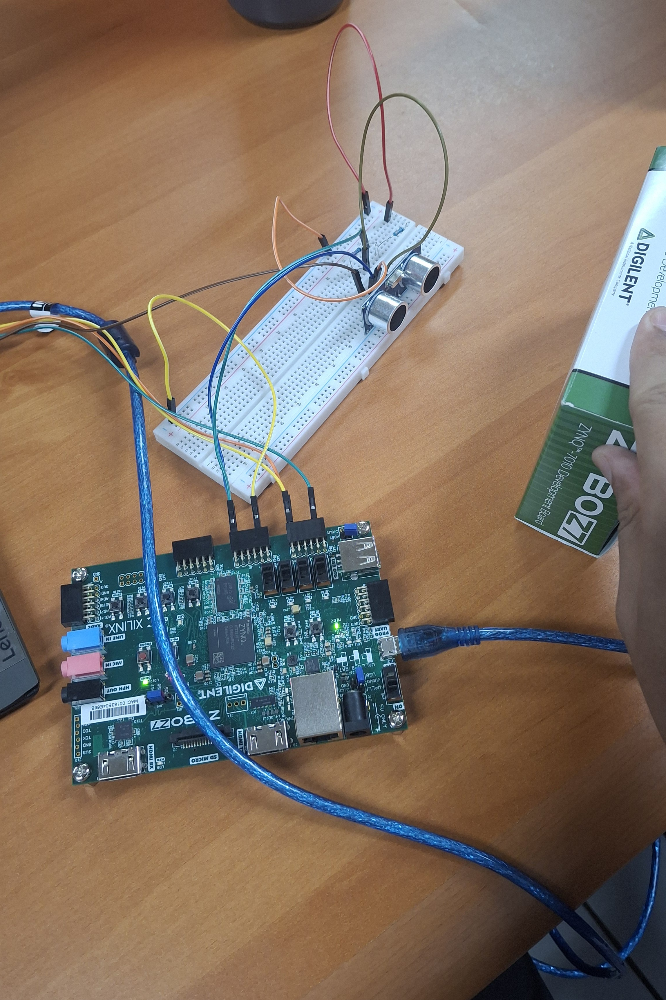
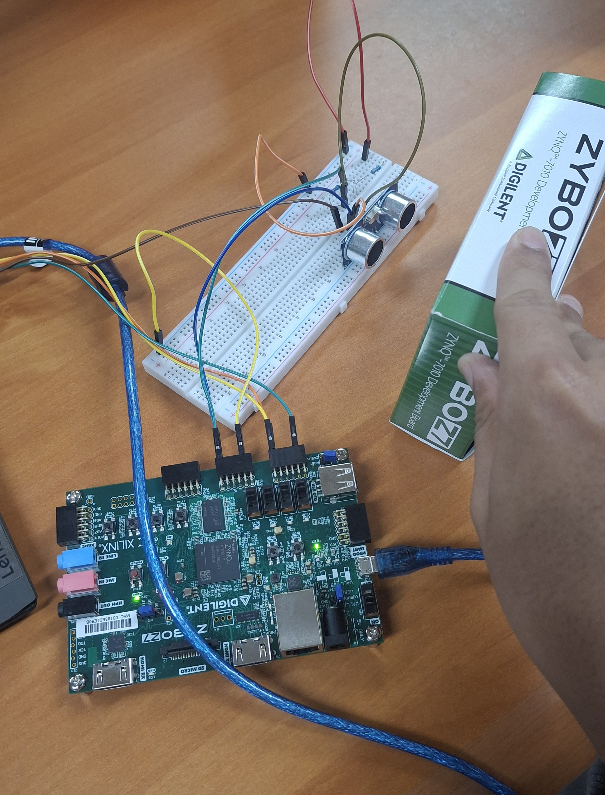

# Zybo Z7-10 HC-SR04 Ultrasonic Distance Meter over UART

Verilog design for the Digilent **Zybo Z7-10** (Zynq-7010, `xc7z010clg400-1`) that
drives an **HC-SR04** ultrasonic sensor, measures round-trip echo time, converts it
to centimeters, and streams the result over UART (115200 8N1) once per second as
an ASCII line such as:

```
D=034cm
```

A small Python serial monitor is included to read and pretty-print that stream on
a PC.

## How it works

1. `hc_sr04_controller.v` — generates a 10 us `TRIG` pulse, synchronizes the async
   `ECHO` input with a 2-flip-flop synchronizer, times how long `ECHO` stays high
   (in microseconds), converts that to centimeters (`echo_us / 58`), and flags
   `data_valid` when a new reading is ready. A 20 ms timeout on `ECHO` prevents the
   FSM from ever stalling if the sensor doesn't respond.
2. `uart_tx.v` — a simple 115200-baud, 8N1 UART transmitter (start bit, 8 data
   bits, stop bit).
3. `top.v` — instantiates both modules, latches the latest distance reading, and
   every 1 second (at 125 MHz system clock) shifts out `"D=xxxcm\r\n"` one
   character at a time over `uart_tx`.

## Hardware wiring

Sensor power (5 V, ≥1 A) comes from an external supply, **not** the Pmod header.
`ECHO` is a 5 V signal and is stepped down to 3.3V-safe logic with a resistor
divider (1.8 kΩ / 3.3 kΩ) before reaching the FPGA.

| Signal                     | HC-SR04 / USB-UART pin | Zybo Z7-10 pin      | Package pin |
|----------------------------|-------------------------|---------------------|-------------|
| `hc_trig` (FPGA -> sensor) | TRIG                     | Pmod JD, pin 7      | `U14`       |
| `hc_echo` (sensor -> FPGA) | ECHO (through divider)   | Pmod JD, pin 1      | `T14`       |
| GND (sensor)               | GND                      | Pmod JD, pin 5      | —           |
| `uart_tx` (FPGA -> PC)     | USB-UART RXD             | Pmod JE, pin 7      | `V13`       |
| GND (USB-UART)             | USB-UART GND             | Pmod JE, pin 5      | —           |
| `clk`                      | on-board 125 MHz osc.    | —                    | `K17`       |

The USB-UART dongle's TXD line (Pmod JE pin 1 / `V12`) is intentionally left
unconstrained — this design only transmits, it never reads from the PC.

Pin assignments were verified against Digilent's official
[`Zybo-Z7-Master.xdc`](https://github.com/Digilent/digilent-xdc), not just the
board silkscreen, to make sure they match the physical Pmod pin numbering.

## Building in Vivado

1. Create a new RTL project targeting part `xc7z010clg400-1`.
2. Add `hc_sr04_controller.v`, `uart_tx.v`, and `top.v` as design sources.
3. Add `Zybo-Z7-10.xdc` as the constraints file.
4. Set `top` as the top module, run Synthesis -> Implementation -> Generate
   Bitstream, then program the device through Hardware Manager.

## Watching the output

With the bitstream running and the USB-UART dongle plugged in:

```powershell
python serial_monitor.py
```

It auto-detects the CP210x USB-UART bridge, parses each `D=xxxcm` line, and
prints `[HH:MM:SS] distance = xxx cm`. Pass a COM port explicitly
(`python serial_monitor.py COM13`) if auto-detect picks the wrong device, or
`--hex` to also dump raw bytes. `Ctrl+C` to stop.

## Hardware setup

| | |
|---|---|
|  |  |

HC-SR04 on a breadboard, wired into Pmod JD (trig/echo + voltage divider) and
Pmod JE (UART), driven by a Zybo Z7-10.

## Powershell Output


## Files

| File                       | Description                                   |
|----------------------------|------------------------------------------------|
| `hc_sr04_controller.v`     | HC-SR04 trigger/echo FSM + distance calculation |
| `uart_tx.v`                | 115200 8N1 UART transmitter                    |
| `top.v`                    | Top-level integration + 1 Hz UART reporting    |
| `Zybo-Z7-10.xdc`           | Pin/clock constraints for this wiring          |
| `serial_monitor.py`        | PC-side serial monitor (Python, pyserial)      |
